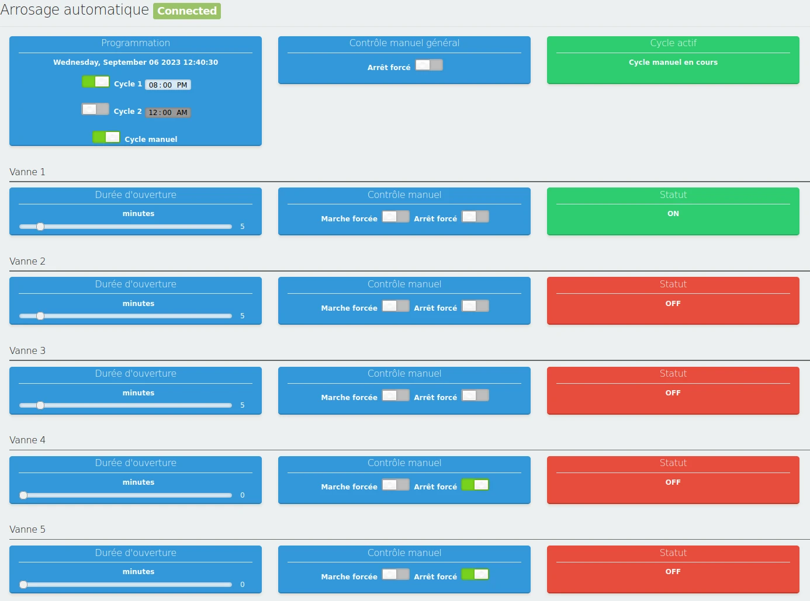
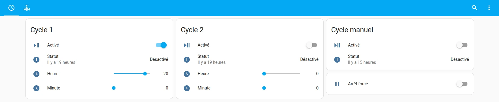
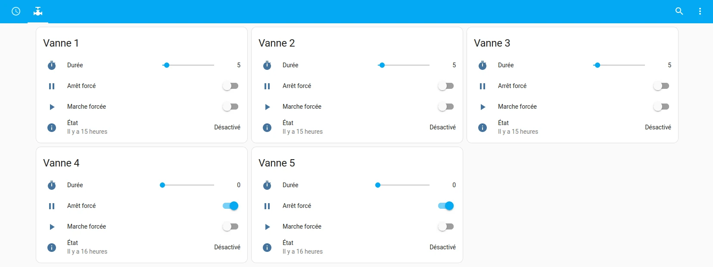

# Auto Watering

This is the project firmware for ESP32, it has been tested on ESP32 DevKit C
board.

The auto watering scheduling is done through a web user interface.


Below are detailed two methods to work on this project:
- Arduino IDE
- PlatformIO

But first of all, you have to configure your project.
Use `config.h.example` to set your `config.h` file with the right options for
you.

If using MQTT with HomeAssistant, an example dashboard code for two cycles and
two valves is provided in `HomeAssistant-dashboard-example.yaml`. You will have
to enable `USE_MQTT` and set `MQTT*` options in your `config.h`.





## Arduino IDE

In Arduino IDE, use "ESP32 Dev Module" card.

Required librairies:
- AsyncTCP 1.1.4
- ArduinoJson 6.21.2
- ESPAsyncWebServer (https://github.com/me-no-dev/ESPAsyncWebServer, changeset f71e3d4)
- ESPUI 2.2.1
- CRC32 2.0.0
- PubSubClient 2.8.0 (only if you plan to use MQTT client)

## PlatformIO

Build the project:
```
platformio run
```

Upload on the board:
```
platformio run -t nobuild -t upload
```

To connect to serial console, you can use picocom:
```
picocom -b 115200 /dev/ttyUSB0
```
(use `CTRL+A-X` to exit).
From there you can see the device IP address and log messages.
